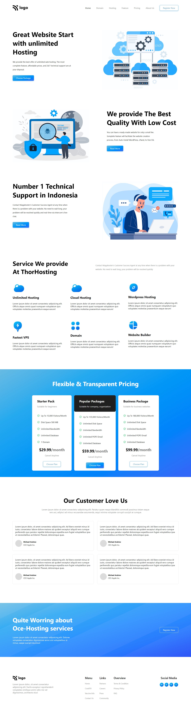

# **Saiprasad Ingle**

## **Project - 11**

## Project Title - Hosting Landing page
This is Landing page made by using Html & Css.

##  Time to complete this project :-

## What I have Learned in this Project :-

- How to give - **Position to Element**.
- How to Make - **Beautiful Buttons**.
- Layout Making Using - **Flexbox**.
- How to Use of - **Css Selector**.
- Lean about - **Media query**

## Technology Used :-

Project  built from using

 
**&**

[Click Me](https://chic-capybara-6219ed.netlify.app) to see the project Demo.

## Screenshot of  project :-

## Features :-

- Live previews
- Fullscreen mode
- Mobile responsive
- Tablet responsive

## 🔗 Links
